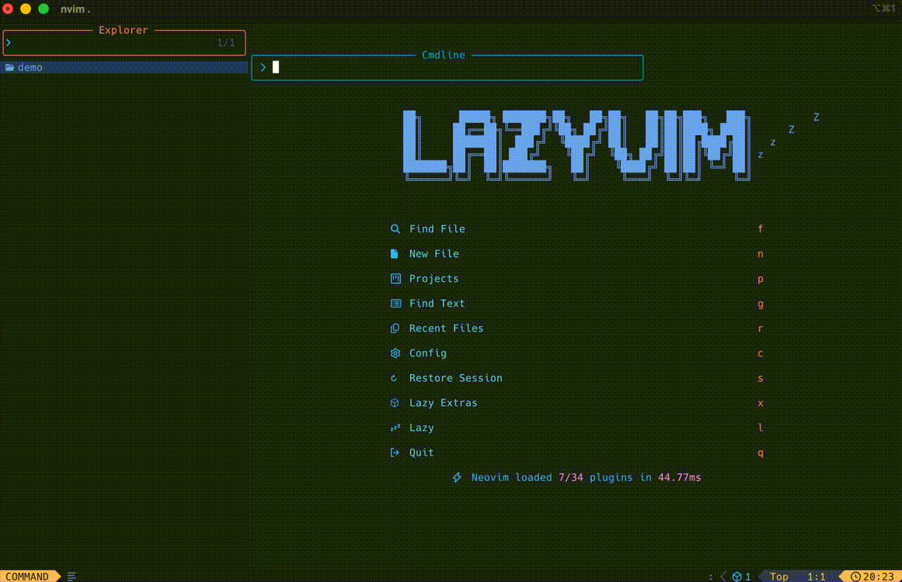

# cursoragent.nvim

A Neovim plugin for seamless integration with Cursor Agent CLI. Provides terminal-based interface with MCP server support, automatic file refresh, diff visualization, and support for multiple Cursor Agent modes.

## Demo



> **Note**: This plugin ports and adapts code from [greggh/claude-code.nvim](https://github.com/greggh/claude-code.nvim) to work with Cursor Agent CLI. The MCP server implementation, diff functionality, selection tracking, and file explorer integrations are ported from claude-code.nvim with modifications for Cursor Agent compatibility. The original terminal interface concept is inspired by [xTacobaco/cursor-agent.nvim](https://github.com/xTacobaco/cursor-agent.nvim).

## Requirements

- Neovim 0.9.0 or higher
- Cursor Agent CLI: `cursor-agent` available on your `$PATH`

## Installation

### lazy.nvim

```lua
{
  "eun2ce/cursoragent.nvim",
  dependencies = {
    "nvim-lua/plenary.nvim",
  },
  config = function()
    require("cursoragent").setup({})
  end,
}
```

### packer.nvim

```lua
use({
  "eun2ce/cursoragent.nvim",
  requires = { "nvim-lua/plenary.nvim" },
  config = function()
    require("cursoragent").setup({})
  end,
})
```

## Quickstart

- Run `:CursorAgent` or `:CursorAgentAgent` to toggle an interactive terminal (agent mode)
- Use `:CursorAgentAsk` or `:CursorAgentPlan` for specific modes
- Use `:CursorAgentResume` to resume the most recent conversation
- Visually select code and use `:CursorAgentSelection` to send it
- Use `:CursorAgentBuffer` to send the entire current buffer

## Commands

- `:CursorAgent` - Toggle the interactive Cursor Agent terminal
- `:CursorAgentAgent` - Launch in agent mode (default)
- `:CursorAgentAsk` - Launch in ask mode
- `:CursorAgentPlan` - Launch in plan mode
- `:CursorAgentResume` - Resume the most recent conversation
- `:CursorAgentSelection` - Send the current visual selection
- `:CursorAgentBuffer` - Send the full current buffer

## Configuration

```lua
require("cursoragent").setup({
  -- Terminal Window Settings
  terminal = {
    split_side = "right", -- "left" or "right"
    split_width_percentage = 0.4, -- Screen ratio (0.0 to 1.0)
    provider = "native", -- "auto", "snacks", "native", "external", "none"
    auto_close = true, -- Close terminal window when process exits
    show_native_term_exit_tip = true, -- Show tip about Ctrl-\ Ctrl-N
    git_repo_cwd = true, -- Set CWD to Git root when opening in a Git project
  },

  -- MCP Server Settings
  auto_start = true, -- Automatically start MCP server
  port_range = { min = 10000, max = 65535 },
  log_level = "info", -- "trace", "debug", "info", "warn", "error"

  -- Selection Tracking
  track_selection = true, -- Auto-track visual selections
  focus_after_send = false, -- Focus terminal after sending selection
  visual_demotion_delay_ms = 50, -- Delay before demoting visual selection

  -- Connection Settings
  connection_wait_delay = 600, -- Wait time after connection (ms)
  connection_timeout = 10000, -- Max time to wait for connection (ms)
  queue_timeout = 5000, -- Max time to keep @ mentions in queue (ms)

  -- Diff Settings
  diff_opts = {
    layout = "vertical", -- "vertical" or "horizontal"
    open_in_new_tab = false, -- Open diff in new tab
    keep_terminal_focus = false, -- Keep focus in terminal after diff opens
    hide_terminal_in_new_tab = false, -- Hide terminal in new diff tab
    on_new_file_reject = "keep_empty", -- "keep_empty" or "close_window"
  },

  -- Command Settings (optional)
  terminal_cmd = nil, -- Use default "cursor-agent" or specify custom path
  env = {}, -- Custom environment variables

  -- Command variants (for backward compatibility)
  command_variants = {
    agent = "agent",
    ask = "ask",
    plan = "plan",
    resume = "--resume",
  },
})
```

See `lua/cursoragent/config.lua` for all available options.

## How It Works

- **MCP Server**: Neovim runs a WebSocket server that communicates with Cursor Agent CLI via MCP protocol
- **Terminal Integration**: Terminal windows are created using Neovim's terminal API
- **Selection Tracking**: Visual selections are automatically tracked and sent as @ mentions
- **Diff Visualization**: Code changes are displayed in a side-by-side diff view
- **File Refresh**: File changes are automatically detected and buffers are reloaded when Cursor Agent modifies files
- **Working Directory**: The terminal starts in the detected project root (git root if available)

## Features

- **Multiple Modes**: Support for agent, ask, plan, and resume modes
- **MCP Integration**: Full MCP server support for seamless communication
- **Diff View**: Side-by-side diff visualization for code changes
- **Selection Tracking**: Automatic tracking of visual selections
- **File Explorer Integration**: Works with neo-tree, nvim-tree, oil.nvim, and more
- **Terminal Providers**: Support for native, snacks, and external terminal providers

## Troubleshooting

- **CLI not found**: Ensure `cursor-agent` is on your `$PATH`
- **No output appears**: Verify your CLI installation by running it in a normal terminal
- **Wrong directory**: The terminal starts in your project root (git root if available)
- **MCP connection issues**: Check the log level and ensure the port range is available

## Acknowledgements

This project ports and adapts significant portions of code from the following projects:

- **[greggh/claude-code.nvim](https://github.com/greggh/claude-code.nvim)** - MCP server implementation, diff functionality, selection tracking, file explorer integrations, and terminal management. Ported with modifications for Cursor Agent CLI compatibility. Original code is licensed under MIT License.
- **[xTacobaco/cursor-agent.nvim](https://github.com/xTacobaco/cursor-agent.nvim)** - Original terminal interface concept and minimal implementation. Licensed under MIT License.

Both projects are licensed under the MIT License, and this project maintains the same license. The original copyright notices and license terms are preserved in the ported code.

- Cursor Agent CLI by Cursor
